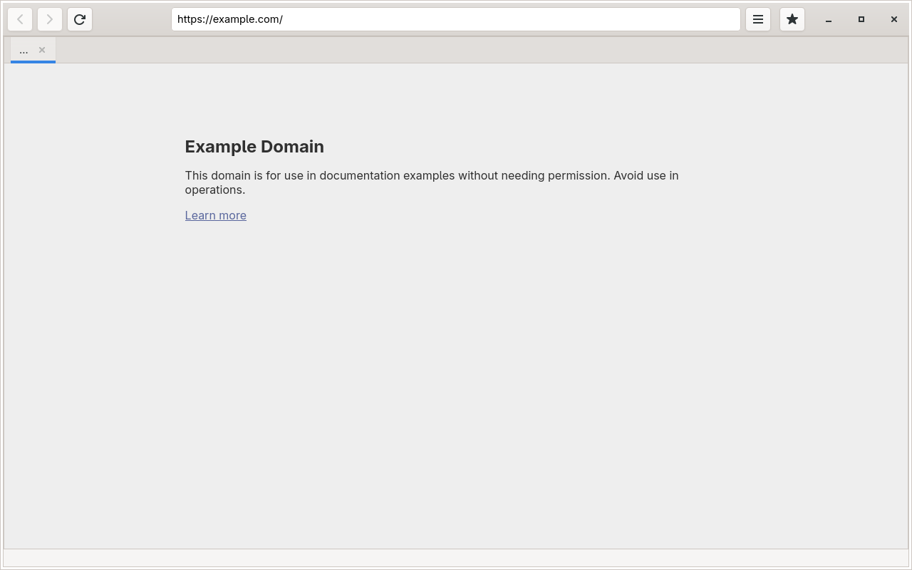
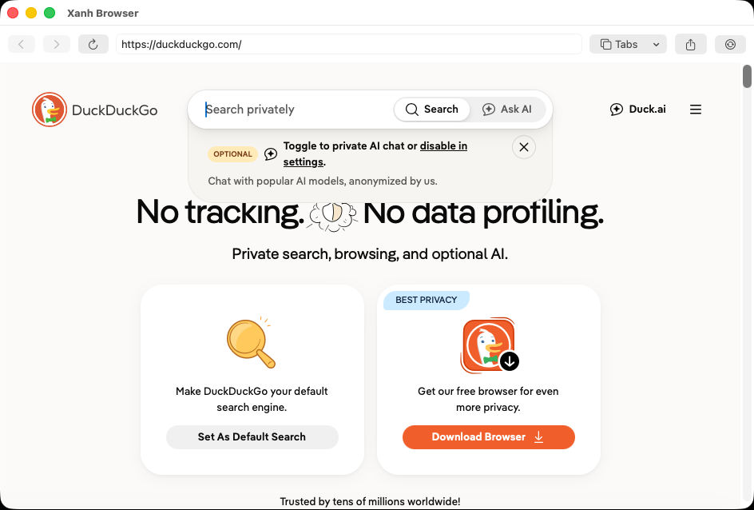
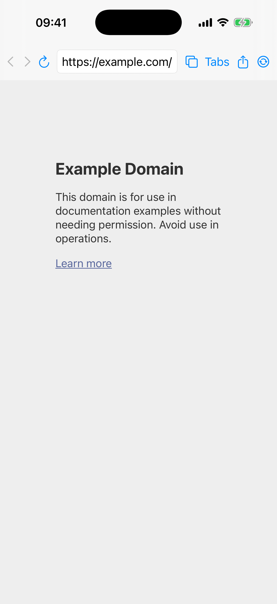
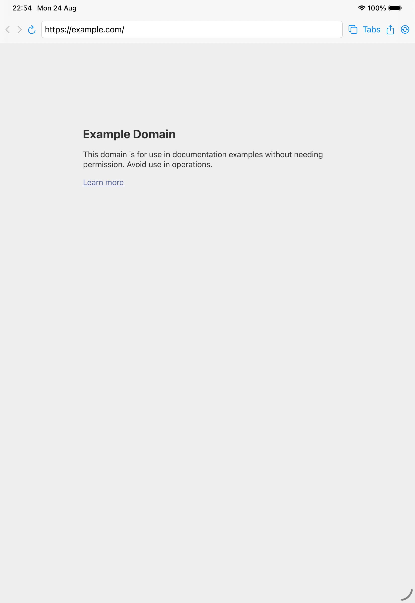
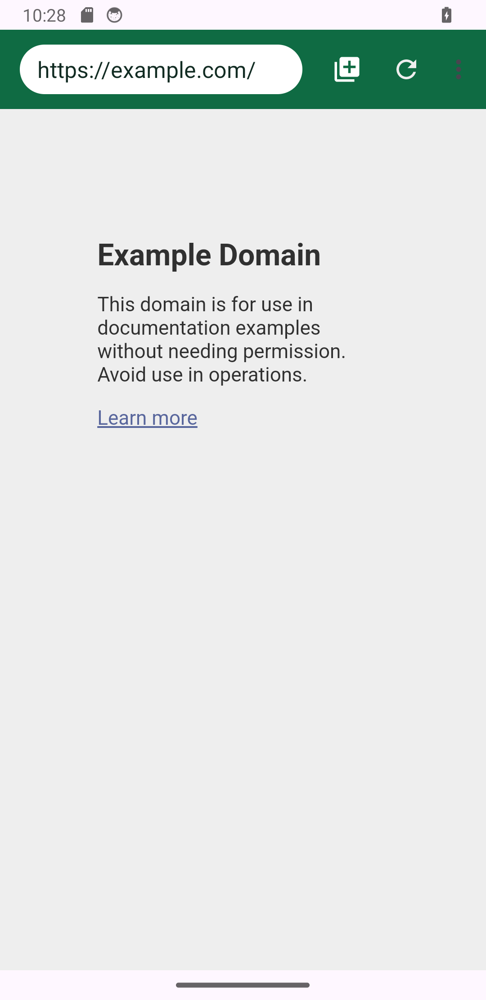

<p align="center">
  
</p>

<h1 align="center">Xanh WebKit</h1>

<p align="center">
  Native browser hosts, shared privacy contracts and reproducible engine gates
  for the Xanh Browser family.
</p>

<p align="center">
  <a href="https://github.com/LamPPKK/xanh-webkit/actions/workflows/desktop.yml"></a>
  <a href="https://github.com/LamPPKK/xanh-webkit/actions/workflows/android-lite.yml"></a>
  <a href="https://github.com/LamPPKK/xanh-webkit/actions/workflows/apple.yml"></a>
  <a href="https://github.com/LamPPKK/xanh-webkit/actions/workflows/windows.yml"></a>
  <a href="COPYING"></a>
</p>

Xanh WebKit is the multi-platform reference workspace for Xanh Browser. It
contains the Linux desktop browser, Android Lite, shared Apple applications,
the Windows host and two experimental WebKit editions. The full multi-tab
Android app is maintained in [`xanh-android`](https://github.com/LamPPKK/xanh-android).

This is not a single engine compiled for every platform. Each edition keeps a
native UI, engine, security boundary and lifecycle model; shared feature names
describe common product contracts, not identical engine binaries.

> **Release status:** Linux and Android Lite 1.0.0 are release candidates.
> Apple, Windows, Android WPE and Windows WinCairo are preview candidates.
> Application workflows produce unsigned verification artifacts; the separate
> protected source-release workflow can emit a GPG-signed source archive. The
> hosted Linux desktop lane
> still has a pre-existing native ad-block boundary build blocker, while the
> Windows and related CodeQL lanes retain pre-existing C#/XAML build blockers.
> Do not publish production artifacts until every gate in
> [`RELEASING.md`](RELEASING.md) passes.

## Verified previews

<table>
  <tr>
    <td align="center" width="33%">
      <br>
      <strong>Linux</strong>
    </td>
    <td align="center" width="33%">
      <br>
      <strong>macOS</strong>
    </td>
    <td align="center" width="33%">
      <strong>Windows</strong><br><br>
      <em>A native capture still requires an interactive Windows 11 desktop;
      hosted verification runners do not provide a usable UI session.</em>
    </td>
  </tr>
</table>

<table>
  <tr>
    <td align="center" width="25%">
      <br>
      <strong>iPhone</strong>
    </td>
    <td align="center" width="25%">
      <br>
      <strong>iPad</strong>
    </td>
    <td align="center" width="25%">
      <br>
      <strong>Android</strong>
    </td>
    <td align="center" width="25%">
      <br>
      <strong>Android tabs</strong>
    </td>
  </tr>
</table>

These are direct captures from native application builds, using clean profiles
and neutral pages rather than product mockups. The Android multi-tab capture
represents the companion `xanh-android` application. Windows remains
text-only until it can be captured in an interactive Windows session.

## Editions and status

| Edition | Native host and engine | Status |
| --- | --- | --- |
| Linux desktop | GTK 4 + WebKitGTK 6.0 | 1.0.0 release candidate |
| Android Lite | Android UI + System WebView through AndroidX WebKit | 1.0.0 release candidate; API 26+ |
| Apple | SwiftUI + operating-system WebKit | 1.0.0 preview; macOS/iOS/iPadOS 26 |
| Windows | WinUI 3 + Evergreen WebView2 | 1.0.0 preview; x64/ARM64 |
| Android Lite WebKit | Android UI + WPEView/WPE WebKit | 1.0.0 preview; API 31+ |
| Windows WebKit | Upstream WebKit WinCairo MiniBrowser | 1.0.0 laboratory preview; x64 only |

Android Lite intentionally remains a one-tab browser. The full Android edition
owns multi-tab browsing, profiles and its separate production checklist.

## Key capabilities

- Native multi-tab browsing on Linux, Apple and Windows, with regular/private
  separation and bounded process recovery. Linux includes local bookmarks,
  history and downloads; Apple and Windows add Places and Logins through their
  separately gated Firefox Sync hosts.
- A compact Android Lite host with navigation/search, sharing, desktop mode,
  scoped downloads, file upload, geolocation consent and privacy clearing.
- Native content blocking backed by the pinned MPL-2.0
  [`adblock-rust`](https://github.com/brave/adblock-rust) 0.13.3 core. The
  current contract supports network rules, exceptions and convertible cosmetic
  filters; it does not claim uBlock Origin parity, scriptlets, procedural
  cosmetics, redirect resources, CSP or `removeparam` support. The published
  Android WPE preview is excluded because its host exposes no reviewed content
  filtering API.
- Optional Mozilla Accounts and Firefox Sync through the pinned
  `xanh-sync-core` boundary for bookmarks, history, tabs and Logins. Ordinary
  verification artifacts omit the production Mozilla runtime; approved or
  explicitly self-hosted configuration and platform security evidence remain
  required.
- A portable encrypted `.xanhbackup` format shared by Android, Android Lite,
  Windows WebView2 and WinCairo. It excludes cookies, passwords, cache and
  private state, but retained URL query and fragment data can still be
  sensitive. Linux and Apple do not claim this interchange format here.
- Six native Linux plugins and a permission-checked Manifest V2 WebExtension
  subset. Manifest V3 and complete Chrome/Firefox extension API compatibility
  are outside the 1.0 scope.

## Engine boundaries

| Host | Rendering backend | Boundary |
| --- | --- | --- |
| Linux | WebKitGTK 6.0 / JavaScriptCoreGTK | Shared floor in [`WEBKITGTK_MIN_VERSION`](WEBKITGTK_MIN_VERSION) |
| Apple | System WebKit via SwiftUI `WebPage` and `WebView` | Engine ships and updates with the OS |
| Android Lite | System WebView via AndroidX WebKit 1.17.0 | Serviced production path |
| Android WebKit preview | WPEView 0.3.3, reporting WPE WebKit 2.50.6 | Below the repository's 2.52.6 floor and not yet 16 KiB-clean; production gate closed |
| Windows | Evergreen WebView2 | Serviced migration path; startup enforces a stable runtime floor |
| Windows WebKit preview | Pinned upstream WinCairo source revision | x64 laboratory backend; no supported upstream embedding SDK/runtime |

The repository tracks the alpha
[`Xanh WebView`](https://github.com/LamPPKK/xanh-webview) embedding contract in
[`XANH_WEBVIEW.lock`](XANH_WEBVIEW.lock). The API permits OS-specific backends;
it is not an Android system-provider package and does not imply one renderer
across all operating systems. Android WPE, Windows CEF and WinCairo cutovers
remain capability-, architecture-, security- and packaging-gated. See
[`docs/XANH_WEBVIEW.md`](docs/XANH_WEBVIEW.md) for the backend and fork policy.

## Build and test

### Linux desktop

Requires CMake 3.24+, Ninja, Vala 0.56+, GLib 2.74+, GTK 4.10+,
WebKitGTK/JavaScriptCoreGTK 6.0 at the version in
[`WEBKITGTK_MIN_VERSION`](WEBKITGTK_MIN_VERSION), libsoup 3, SQLite, libpeas 2,
GCR 4, JSON-GLib and Rust 1.97.1.

```sh
cargo build --locked --release --manifest-path xanh-adblock-core/Cargo.toml
cmake -S . -B _build -G Ninja \
  -DCMAKE_BUILD_TYPE=Release \
  -DXANH_ENABLE_ADBLOCK_RUST=ON \
  -DXANH_ADBLOCK_CORE_LIBRARY="$PWD/xanh-adblock-core/target/release/libxanh_adblock_core.so"
cmake --build _build
ctest --test-dir _build --output-on-failure
cmake --build _build --target validate-metadata
```

The uninstalled executable is `_build/xanh-browser`. To inspect the installed
layout without touching the host system:

```sh
DESTDIR="$PWD/_artifact" cmake --install _build
```

### Android Lite

Use JDK 17, Android SDK Platform 37.1 and Build Tools 36.1.0. Shipping apps keep
target API 36.

```sh
./gradlew --no-daemon \
  :backup-core:testDebugUnitTest \
  :app:lintDebug \
  :app:testDebugUnitTest \
  :app:assembleDebug \
  :app:assembleAndroidTest \
  :app:bundleRelease
```

Without upload-signing credentials, `bundleRelease` produces an unsigned
verification bundle; when all credentials are configured, Gradle applies the
release signing configuration. Native-backed release verification first runs
`scripts/build-adblock-android.sh` and supplies its output through
`-PxanhAdblockNativeDir`; production publishing uses the guarded task described
in [`RELEASING.md`](RELEASING.md). WPE preview commands and its source-fork
contract are in [`app-webkit/README.md`](app-webkit/README.md).

### Apple

Use Xcode 26 or newer:

```sh
cd platform/apple
xcodegen generate
swift test
xcodebuild -project XanhBrowserApple.xcodeproj \
  -scheme XanhBrowser-macOS -configuration Debug \
  CODE_SIGNING_ALLOWED=NO build
xcodebuild -project XanhBrowserApple.xcodeproj \
  -scheme XanhBrowser-iOS -sdk iphonesimulator \
  -destination 'platform=iOS Simulator,name=iPhone 17' \
  CODE_SIGNING_ALLOWED=NO build
```

See [`platform/apple/README.md`](platform/apple/README.md) for signing, Sync and
device-test gates.

### Windows

Use .NET SDK 10.0.400 with the Windows App SDK and an Evergreen WebView2
Runtime at or above the checked startup floor:

```powershell
dotnet test platform/windows/tests/XanhBrowser.Core.Tests/XanhBrowser.Core.Tests.csproj
dotnet build platform/windows/src/XanhBrowser.Windows/XanhBrowser.Windows.csproj `
  --configuration Release `
  -p:Platform=x64 `
  -p:XanhAdblockNativeDll=C:\absolute\path\to\xanh_adblock_core.dll
```

See [`platform/windows/README.md`](platform/windows/README.md) for publishing
and [`platform/windows-webkit/README.md`](platform/windows-webkit/README.md) for
the pinned WinCairo source build.

### Shared Rust boundaries

```sh
cargo test --locked --manifest-path xanh-adblock-core/Cargo.toml
cargo test --locked --manifest-path xanh-sync-core/Cargo.toml
```

The workflows under [`.github/workflows/`](.github/workflows/) are the
authoritative build, lint, instrumentation, dependency-baseline, fuzzing and
artifact commands.

## Privacy, security and release scope

- Navigation targets are bounded and validated before load. Unsafe schemes,
  malformed hosts/ports, userinfo, controls and stale lifecycle callbacks fail
  closed; external handoff requires an explicit, validated user action.
- Private/InPrivate tabs use platform-appropriate ephemeral boundaries and are
  excluded from session, history, Sync and portable-backup persistence.
- Powerful permissions, file selection, HTTP authentication, downloads and
  credential access remain native, request-scoped and cancel on stale tab,
  document, process or foreground state where supported.
- Portable backups use PBKDF2-HMAC-SHA256 and AES-256-GCM and are limited to
  1 MiB and 50 tabs before parsing. They are not a credential or cookie backup.
- Signing keys, passwords and production OAuth credentials must never be
  committed. Mozilla-hosted Sync requires registered per-edition client IDs
  and approval; self-hosted Sync must use the documented HTTPS configuration.
- Signed Apple and Windows distribution, production Firefox Sync, Android WPE
  and WinCairo remain blocked until their platform-specific security, device,
  interoperability, signing and store gates pass.

For threat boundaries and current claims, read
[`docs/ADBLOCK.md`](docs/ADBLOCK.md),
[`docs/FIREFOX_SYNC.md`](docs/FIREFOX_SYNC.md),
[`docs/PORTABLE_BACKUP.md`](docs/PORTABLE_BACKUP.md) and
[`RELEASING.md`](RELEASING.md).

## Repository map

| Path | Purpose |
| --- | --- |
| `desktop/`, `ui/`, `plugins2/` | GTK 4 browser, UI and native plugin ABI 2 modules |
| `tests-modern/` | Linux unit, policy, integration and smoke tests |
| `data-xanh/`, `flatpak/` | Desktop metadata, schema, icons and Flatpak packaging |
| `app/`, `backup-core/` | Android Lite and portable-backup implementation |
| `app-webkit/` | Separately installable Android WPE WebKit preview and source-fork contract |
| `sync-feature-*` | On-demand Android Sync UI and engine-specific credential bridges |
| `xanh-adblock-core/` | Pinned `adblock-rust` wrapper, C ABI and WebKit rule converter |
| `xanh-sync-core/` | Mozilla Application Services boundary, UniFFI and stable C ABI |
| `platform/apple/` | Shared macOS, iPhone and iPad application |
| `platform/windows/` | WinUI 3 / WebView2 application |
| `platform/windows-webkit/` | Pinned WinCairo x64 preview |
| `scripts/`, `.github/workflows/` | Baseline verifiers, release gates and CI |

## Xanh suite

| Repository | Role |
| --- | --- |
| [`xanh-webkit`](https://github.com/LamPPKK/xanh-webkit) | Multi-platform reference hosts, shared engine policies and release gates |
| [`xanh-android`](https://github.com/LamPPKK/xanh-android) | Full native multi-tab Android application |
| [`xanh-ios`](https://github.com/LamPPKK/xanh-ios) | Focused SwiftUI/system-WebKit application for iPhone and iPad |
| [`xanh-docker`](https://github.com/LamPPKK/xanh-docker) | Isolated multi-tenant WPE remote-browser runtime |
| [`xanh-tab`](https://github.com/LamPPKK/xanh-tab) | One-controller WPE appliance for constrained hardware |
| [`xanh-webview`](https://github.com/LamPPKK/xanh-webview) | Versioned cross-platform embedding contract |

## Upstream and license

The repository pins upstream WebKit, WPE, `adblock-rust` and Mozilla
Application Services revisions and verifies their version/provenance contracts
in CI. uBlock Origin is a behavior and filter-syntax reference; its GPLv3
WebExtension runtime is not embedded. The historical pre-modernization desktop
source remains available at the `legacy-midori-9.0` tag.

The main GTK browser/application code remains licensed under
[`LGPL-2.1-or-later`](COPYING). Separately packaged first-party components and
imported or forked platform sources declare other licenses, including MPL-2.0
and BSD-family terms; use each component manifest and source header as the
authoritative scope. Bundled and referenced dependencies retain their own
license and notice obligations; see [`THIRD_PARTY_NOTICES.md`](THIRD_PARTY_NOTICES.md).
Release history is recorded in [`CHANGELOG.md`](CHANGELOG.md).
